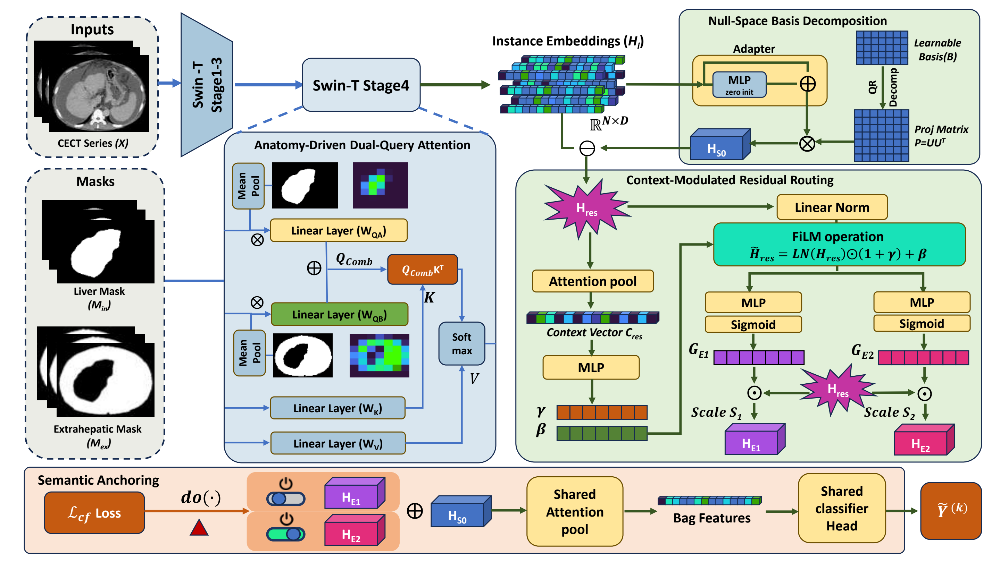

# SLICE-MIL

### MICCAI 2026 | PyTorch | CECT Child-Pugh Grading


Official model code for **SLICE-MIL: Counterfactual Semantic Anchoring of Disentangled Evidence for Child-Pugh Grading**.

SLICE-MIL is a spatial-logical multiple-instance learning framework for patient-level Child-Pugh grading from portal venous phase CECT. It uses anatomy-driven dual-query attention to decouple intra-hepatic and extra-hepatic signals, then decomposes slice-level embeddings into a compensated basis and stage-specific evidence increments. Counterfactual semantic anchoring regularizes the evidence branches according to the ordinal progression of CP-A, CP-B, and CP-C.

<p align="center">
  
</p>

## Method Overview

```text
CECT slices + anatomical masks
        |
        v
ADDA-Swin-T encoder
        |
        v
instance embeddings H_i
        |
        v
Null-space basis decomposition
  H_S0  = F P
  H_res = F (I - P)
        |
        v
Context-modulated residual routing
  H_E1, H_E2
        |
        v
factual and counterfactual MIL representations
```

Counterfactual branches:

```text
factual:       AttnPool(H_S0 + H_E1 + H_E2)
do(E2 = 0):    AttnPool(H_S0 + H_E1)
do(E1 = 0):    AttnPool(H_S0 + H_E2)
do(E1,E2 = 0): AttnPool(H_S0)
```

## Repository Layout

```text
.
|-- adda_swin_t.py       # ADDA-Swin-T encoder
|-- slice_mil_model.py   # SLICE-MIL logical MIL head
|-- losses.py            # Counterfactual semantic anchoring objective
|-- requirements.txt     # Python package requirements
|-- LICENSE              # Non-commercial research license
`-- README.md
```

## Installation

Recommended environment:

```text
Python 3.11.13
CUDA 12.1
PyTorch 2.5.1
```

Install dependencies:

```bash
conda create -n slice_mil python=3.11.13
conda activate slice_mil
pip install -r requirements.txt
```

## Components

### ADDA-Swin-T Encoder

File: `adda_swin_t.py`

Main class:

```python
from adda_swin_t import ADDASwinTinyEncoder
```

The encoder follows a Swin-Tiny hierarchy. Stage 1-3 use standard shifted-window self-attention, while Stage 4 uses anatomy-driven dual-query attention with shared `K` and `V`.

### SLICE-MIL Head

File: `slice_mil_model.py`

Main class:

```python
from slice_mil_model import SLICEMILHead
```

The MIL head contains a zero-initialized residual adapter, global QR-based basis decomposition, context-modulated residual routing, and two gated evidence increments `E1` and `E2`.

### Counterfactual Loss

File: `losses.py`

Main class:

```python
from losses import SLICEMILCounterfactualLoss
```

The loss implements:

```text
L = CE(factual, y)
  + lambda_cf * [
      CE(do(E2 = 0), min(y, 1))
    + CE(do(E1 = 0), y * I(y != 1))
    + CE(do(E1 = 0, E2 = 0), 0)
  ]
```

The classifier should be shared across factual and counterfactual branches.

## Experimental Protocol

Settings reported in the paper:

| Item | Setting |
| --- | --- |
| Modality | portal venous phase CECT |
| Task | patient-level Child-Pugh grading |
| Label mapping | CP-A: 0, CP-B: 1, CP-C: 2 |
| Learning setting | weakly supervised MIL |
| Backbone | Swin-Tiny initialized with ImageNet-1K weights |
| Optimizer | AdamW |
| Epochs | 100 |
| Counterfactual weight | `lambda_cf = 0.5` |
| Primary metric | Quadratic Weighted Kappa |
| Additional metrics | AUC, accuracy |

## Anatomical Masks

SLICE-MIL uses anatomical masks for the ADDA encoder:

- `m_in`: intra-hepatic mask, usually the liver mask.
- `m_ex`: extra-hepatic context mask.

TotalSegmentator can be used to generate liver masks from CT volumes:

```bash
pip install TotalSegmentator
```

Official TotalSegmentator repository: <https://github.com/wasserth/TotalSegmentator>

## Notes

- Every MIL bag must contain at least one valid instance.
- Counterfactual branches are returned as representations; apply one shared classifier before calling `SLICEMILCounterfactualLoss`.
- Commercial use requires prior written authorization.

## Citation

```bibtex
@inproceedings{slice_mil_2026,
  title     = {SLICE-MIL: Counterfactual Semantic Anchoring of Disentangled Evidence for Child-Pugh Grading},
  booktitle = {Medical Image Computing and Computer-Assisted Intervention -- MICCAI 2026},
  year      = {2026}
}
```

## License

This code is released for non-commercial academic, research, and educational use. See [LICENSE](LICENSE) for details.
